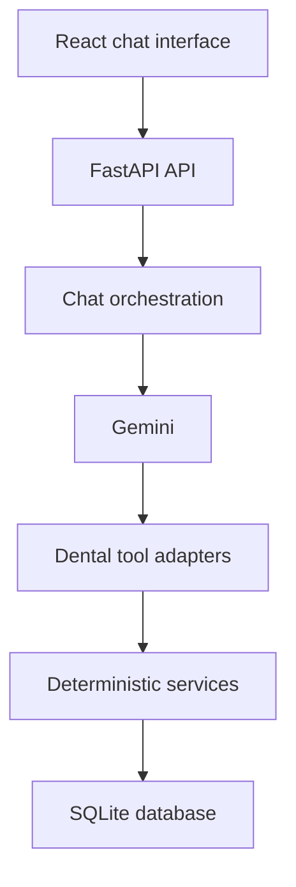

# DentalPracticeChatbot

A full-stack, AI-assisted dental receptionist that helps patients register, verify their identity, find appointment availability, book appointments, reschedule or cancel existing appointments, and escalate dental emergencies.

The application uses an LLM for natural-language conversation and deterministic backend services for all database operations. The LLM can interpret requests and select tools, but it cannot directly modify the database.

## Working Prototype

The prototype supports these workflows:

* Register a new patient
* Verify a returning patient
* Find available appointment slots
* Book an appointment
* Prevent double-booking
* View scheduled appointments
* Cancel an appointment
* Reschedule an appointment
* Book back-to-back appointments for multiple family members atomically
* Escalate potential dental emergencies to staff
* Answer practice information questions
* Automatically try to book the earliest available appointment for a known
    patient with a non-life-threatening urgent dental concern
* Maintain context across a multi-turn conversation

## Technology Stack

### Frontend

* React
* TypeScript
* Vite
* CSS

### Backend

* Python 3.11
* FastAPI
* SQLAlchemy
* SQLite
* Pydantic
* Pytest

### AI Integration

* Gemini API
* Gemini Interactions API
* Function/tool calling
* Server-side conversation state

The default model can be configured through the environment rather than being hard-coded.

## Architecture



The application is divided into four main layers:

1. The React frontend displays the conversation and sends messages to FastAPI.
2. The chat service manages Gemini interactions and tool-call loops.
3. Tool adapters translate structured LLM requests into application service calls.
4. Deterministic services validate and perform database operations.

Gemini never receives direct database access or arbitrary SQL execution capability.

## Project Structure

```text
DentalPracticeChatbot/
├── README.md
├── .gitignore
├── backend/
│   ├── requirements.txt
│   ├── .env.example
│   ├── seed.py
│   ├── app/
│   │   ├── main.py
│   │   ├── database.py
│   │   ├── models.py
│   │   ├── services/
│   │   │   ├── chat.py
│   │   │   ├── scheduling.py
│   │   │   ├── patients.py
│   │   │   └── emergencies.py
│   │   └── tools/
│   │       ├── __init__.py
│   │       └── dental_tools.py
│   └── tests/
│       ├── conftest.py
│       ├── test_scheduling.py
│       ├── test_patients.py
│       └── test_emergencies.py
└── frontend/
    ├── package.json
    ├── package-lock.json
    ├── index.html
    ├── vite.config.ts
    └── src/
        ├── App.tsx
        ├── App.css
        ├── index.css
        └── main.tsx
```

## Data Model

### Patients

```text
patients
- id
- full_name
- phone
- date_of_birth
- insurance_name
```

Phone numbers are normalized before storage and are unique per patient.

### Availability

```text
availability
- id
- start_time
- end_time
- status
```

Availability status is either `available` or `booked`.

The seeded practice schedule is:

* Monday through Saturday
* 8:00 AM through 6:00 PM
* Closed Sundays
* One-hour appointment slots
* Availability generated for the next 180 days

Availability slots do not have an appointment type. The requested type, such
as `general` or `emergency`, is collected during booking and stored on the
appointment for staff.

### Appointments

```text
appointments
- id
- patient_id
- slot_id
- appointment_type
- status
- emergency_summary
```

Appointment records remain in the database after cancellation to preserve history. A cancelled appointment releases its slot so it can be booked again.

### Emergency Escalations

```text
emergency_escalations
- id
- patient_id
- contact_phone
- summary
- status
- created_at
```

Emergency escalations are stored with a `pending` status for staff follow-up.
When SMTP settings are configured, staff also receive an email containing the
reported emergency, matched patient details, and the automatic booking result.
Known patients with urgent non-life-threatening concerns are automatically
booked into the earliest available slot with appointment type `emergency`, and
the reported symptoms are saved in `emergency_summary`.

## Supported Chatbot Tools

The LLM can request the following controlled tools:

* `register_patient`
* `verify_patient`
* `find_available_slots`
* `list_patient_appointments`
* `book_appointment`
* `cancel_appointment`
* `reschedule_appointment`
* `book_family_appointments`
* `escalate_emergency`
* `get_practice_information`

Tool declarations and adapters are kept in `backend/app/tools/dental_tools.py`. The underlying business logic remains in service modules.

## Safety and Reliability

### Deterministic scheduling

The LLM does not directly book, cancel, or reschedule appointments. It requests a tool, and the backend validates and executes the action.

### Explicit confirmation

The backend requires a separate, explicit confirmation message before it permits:

* Patient registration
* Appointment booking
* Appointment cancellation
* Appointment rescheduling

This confirmation is checked using the actual user message rather than trusting a model-generated Boolean value.

### Double-booking prevention

A slot must have an `available` status before it can be booked. After booking, its status changes to `booked`. A second booking attempt for the same slot is rejected.

### Patient ownership validation

Cancellation and rescheduling verify that the selected scheduled appointment belongs to the verified patient.

### Internal identifier protection

Database identifiers are used internally for tool execution but are not intended for patients. Customer-facing responses are also sanitized to remove accidental references to slot, patient, or appointment IDs.

### Emergency handling

Potentially life-threatening messages are detected before the LLM is called. This ensures emergency escalation still works if the model is unavailable or rate-limited.

For symptoms such as trouble breathing, uncontrolled bleeding, or severe facial swelling, the application:

1. Advises the patient to call 911 or visit the nearest emergency department.
2. Creates a pending staff escalation record.
3. Avoids diagnosis or routine scheduling advice.

This project is a prototype and is not a substitute for professional medical care.

## Setup

### Prerequisites

Install:

* Python 3.11 or later
* Node.js and npm
* A Gemini API key

### 1. Clone the repository

```powershell
git clone <repository-url>
cd DentalPracticeChatbot
```

### 2. Configure the backend

```powershell
cd backend
py -3.11 -m venv .venv
.\.venv\Scripts\Activate.ps1
python -m pip install -r requirements.txt
```

If PowerShell blocks activation:

```powershell
Set-ExecutionPolicy -Scope Process -ExecutionPolicy Bypass
.\.venv\Scripts\Activate.ps1
```

### 3. Configure environment variables

Copy the example environment file:

```powershell
Copy-Item .env.example .env
```

Update `backend/.env`:

```env
GEMINI_API_KEY=your_gemini_api_key
GEMINI_MODEL=gemini-3.5-flash-lite
```
or any gemini model

### 4. Seed the database

From `backend`:

```powershell
python seed.py
```

This creates:

* A synthetic returning patient
* Monday-through-Saturday appointment availability
* One-hour slots between 8:00 AM and 6:00 PM
* A 180-day booking window

Seeded returning patient:

```text
Name: Alex Morgan
Phone: 416-555-0123
Date of birth: 1995-06-15
Insurance: Sun Life
```

All included patient information is synthetic and intended only for testing.

### 5. Start the backend

```powershell
python -m uvicorn app.main:app --reload
```

Backend:

```text
http://127.0.0.1:8000
```

Interactive API documentation:

```text
http://127.0.0.1:8000/docs
```

Health check:

```text
http://127.0.0.1:8000/health
```

### 6. Start the frontend

Open a second terminal:

```powershell
cd frontend
npm install
npm run dev
```

Open:

```text
http://localhost:5173
```

## Testing Instructions

### Browser testing

Start both the backend and frontend, then test messages such as:

```text
What general appointments are available tomorrow?
```

```text
I am a returning patient.
```

```text
I am a new patient and would like to register.
```

```text
I need to cancel my appointment.
```

```text
I need to reschedule my appointment.
```

Synthetic emergency test:

```text
My face is badly swollen and I am having trouble breathing.
My phone number is 647-555-0100.
```

Do not use genuine patient or health information when testing.

### Backend tests

From `backend`:

```powershell
python -m pytest -v
```

The tests use an isolated in-memory SQLite database and do not modify the local development database.

Test coverage includes:

* Availability search
* Booking
* Double-booking rejection
* Cancellation and slot release
* Rescheduling
* Patient creation
* Phone normalization
* Patient verification
* Duplicate-patient rejection
* Emergency detection
* Life-threatening versus urgent dental emergency classification
* Phone extraction
* Emergency escalation creation
* Automatic earliest-slot booking for known urgent patients

### Frontend validation

From `frontend`:

```powershell
npm run lint
npm run build
```

## API Endpoints

Primary endpoints include:

```text
GET    /health
GET    /slots
POST   /patients
POST   /patients/verify
GET    /patients/{patient_id}/appointments
POST   /appointments
POST   /family-appointments
PATCH  /appointments/{appointment_id}/cancel
PATCH  /appointments/{appointment_id}/reschedule
POST   /chat
```

The REST endpoints make it possible to test deterministic backend behavior independently from the chatbot.

## Example Chat Workflow

A returning-patient booking flow looks like this:

1. The patient requests an appointment.
2. The chatbot asks whether they are new or returning.
3. A returning patient provides their phone number and DOB.
4. The verification tool confirms their identity.
5. The availability tool returns database-backed times.
6. The patient selects a time.
7. The chatbot summarizes the selection and requests confirmation.
8. The patient explicitly confirms.
9. The backend books the slot and prevents conflicting bookings.
10. The chatbot confirms the final date and time.

A family booking flow verifies each family member, finds consecutive
back-to-back slots, summarizes the complete block, and asks for explicit
confirmation. The backend books the appointments in one transaction, so a
failure leaves every slot unchanged.

## Design Decisions and Rationale

### LLM for language, backend for truth

The LLM is useful for interpreting flexible language such as “tomorrow afternoon” or “later next week.” It is not treated as the source of truth for patients, availability, or appointments.

All important records and state transitions are managed by SQLAlchemy services and SQLite.

### Tools instead of direct database access

Exposing narrow tools gives the model only the operations it needs. A generic database or SQL tool would create unnecessary safety and correctness risks.

### Confirmation enforced outside the model

Initially, confirmation was represented by a model-generated argument. Testing showed that the model could treat “I would like this appointment” as final confirmation.

The implementation was changed so the backend evaluates the actual user message. This made confirmation a deterministic application rule rather than a prompt-only preference.

### Historical appointment records

A unique database constraint initially prevented a cancelled slot from being booked again because the cancelled appointment still referenced that slot.

The schema was updated to allow multiple historical appointments to reference the same slot while the availability status prevents simultaneous active bookings.

### Deterministic emergency escalation

Testing showed that a model could generate appropriate emergency language without actually calling the escalation tool.

Emergency detection and database escalation were therefore moved ahead of the LLM call. This ensures the staff record is created even if the LLM is unavailable.

### Relative-date handling

The model initially interpreted “tomorrow” using an incorrect date and occasionally calculated the wrong weekday.

The backend now supplies the current local date dynamically, and availability results contain a backend-calculated weekday. The model is instructed to use those returned values rather than guessing.

### Provider-independent structure

LLM orchestration is isolated in the chat service, while dental tools and business logic are provider-independent. This makes it easier to replace Gemini with another model provider without rewriting scheduling behavior.

## Development Process and Prioritization

The implementation was completed incrementally:

1. Scaffolded React and FastAPI applications.
2. Added SQLite models and realistic seed data.
3. Implemented and manually tested deterministic scheduling services.
4. Added patient registration and verification.
5. Added booking conflict validation.
6. Added cancellation and rescheduling.
7. Connected Gemini using structured function calling.
8. Moved tool definitions into a separate adapter module.
9. Added explicit confirmation safeguards.
10. Added deterministic emergency escalation.
11. Built the React chat interface.
12. Added automated tests and documentation.

The first priority was completing safe, database-backed appointment workflows. Visual polish and additional integrations were intentionally deferred until the core scheduling behavior was reliable.

## Scope Decisions

### Included

* Single-patient scheduling
* New and returning patient flows
* Natural-language date requests
* Multi-turn conversation state
* Database-backed appointment management
* Emergency escalation
* Responsive chat interface
* Automated service tests

### Deferred

* Production authentication and authorization
* Staff administration dashboard
* Email and SMS notifications
* Calendar-provider integration
* Multiple dentists and provider-specific availability
* Production database migrations
* Deployment infrastructure
* Full audit logging and observability

These items were deferred to keep the prototype focused on the highest-value patient workflows within the assessment time limit.

## Known Limitations

* SQLite is suitable for a prototype but not the intended production database.
* Conversation state depends on provider interaction IDs.
* The free Gemini tier may return temporary rate-limit errors during repeated testing.
* Emergency detection uses a conservative phrase list rather than a clinical triage system.
* Authentication is simulated through legal name, phone number, and DOB verification.
* Staff escalations are stored and optional SMTP email notifications are supported, but no staff dashboard is included.
* The seeded schedule contains synthetic availability rather than a live practice calendar.
* Times are treated as the dental practice’s local time and do not currently include explicit timezone conversion.

## Future Improvements

Potential next steps include:

* PostgreSQL and database migrations
* Secure patient authentication
* Role-based staff access
* Twilio SMS notifications
* Email confirmations
* Google Calendar or practice-management integration
* Provider-specific schedules
* A staff escalation dashboard
* Structured logs, metrics, and tracing
* End-to-end browser tests
* Deployment with managed secrets and HTTPS

## Repository Hygiene

The repository excludes:

```text
backend/.env
backend/.venv/
backend/dental_practice.db
frontend/node_modules/
frontend/dist/
__pycache__/
```

A safe `.env.example` is included so reviewers can configure the application without exposing credentials.


## Prioritization and Scope Decisions

This assessment was time-boxed, so I prioritized the workflows that are load-bearing for a safe and useful patient experience: patient registration and verification, finding real availability, booking without double-booking, and cancelling or rescheduling existing appointments. These operations are database-backed and executed through deterministic backend tools. The language model manages the conversation and interprets natural-language requests, but it cannot independently decide that an appointment exists or claim that a database change succeeded.

I prioritized safety-sensitive flows next. Potential emergencies are detected before the normal conversational workflow, appropriate emergency guidance is provided, and an escalation record is created for staff follow-up. Appointment mutations require explicit patient confirmation, and backend validation ensures that the patient, appointment, and slot are valid before any change is committed. Database constraints and transactions protect against concurrent booking conflicts and partial updates. These decisions address the highest-impact failure modes: exposing another patient’s information, fabricating availability, double-booking a slot, changing the wrong appointment, or failing to escalate an urgent situation.

I also prioritized graceful failure handling because external model APIs can be unavailable or rate-limited. Tool results are treated as the source of truth, errors are converted into safe patient-facing responses, and the application avoids reporting success after a failed operation. Patient information and internal identifiers are not intentionally exposed in chatbot responses. In a production deployment, patient authorization would be strengthened with expiring server-managed sessions and one-time phone verification, while logs would exclude personal and health information.

General practice inquiries were implemented using controlled practice information rather than allowing the model to invent policies, prices, addresses, or insurance coverage. The assistant can explain office hours, major insurance acceptance, and options for uninsured patients while directing plan-specific coverage and final pricing questions to staff. Subjective requests such as “tomorrow” or “later next week” are converted into concrete date ranges before querying availability.

Complex family scheduling was treated as an extension of the reliable single-patient workflow. Registration and verification must occur independently for each family member, and back-to-back scheduling requires consecutive-slot searching and an atomic transaction so that either every family appointment succeeds or none do. I prioritized the underlying patient, availability, and booking guarantees before expanding this orchestration. Any portion not completed within the time box is documented as planned work rather than represented as production-ready.

For hundreds of locations and more than 10,000 daily conversations, I would replace the local SQLite database with a managed relational database such as PostgreSQL, associate every record with a practice location, and use transactions and indexes to handle concurrent scheduling safely. I would also introduce distributed session storage, background queues for staff notifications, per-user and per-location rate limiting, structured monitoring without patient data, audit trails for appointment changes, retry and idempotency controls, encrypted storage and transport, backups, and jurisdiction-specific privacy review.

Polished administrative features, advanced insurance integrations, multilingual support, analytics, and fully optimized family scheduling were considered valuable but less critical than completing the core workflow safely. My overall priority was to build a smaller system that performs consequential patient operations reliably, clearly exposes its limitations, and has an architecture that can be strengthened for production rather than a broader demo whose scheduling claims cannot be trusted.